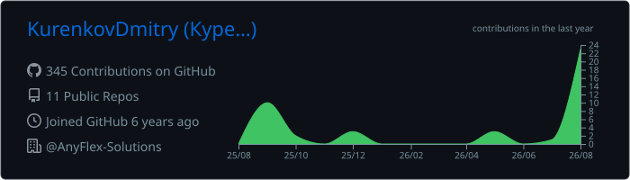
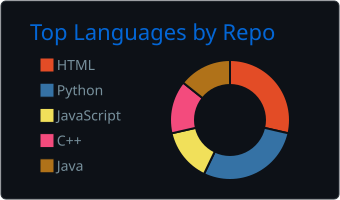
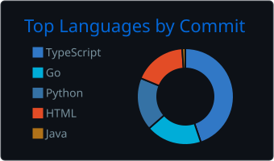
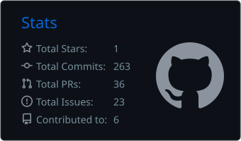
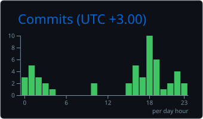

[Projects](#selected-projects) · [Expertise](#expertise) · [Engineering](#engineering-toolbox) · [Contact](#contact)

## About

I am a Technical System Analyst with a strong project background in system design, backend development and solution architecture.

Most of my experience comes from internal and product projects developed at Lateco or/and with the company’s support. In these projects, I worked on requirements analysis, API and integration design, data modelling, microservice architecture, technical documentation and backend development using Java, Go and Python. I also have experience coordinating small development teams and contributing to product development from the initial concept to a working solution.

At T-Bank, I completed an internship as a System Analyst in a credit-products team. I worked on migrating existing functionality to a new implementation while accounting for changes in data processing, storage mechanisms, domain entities and related business logic. My responsibilities included analysing the current implementation, formalising requirements for the target solution, supporting development and testing some the migrated functionality.

My main areas of interest and experience are:

- Technical system analysis and solution design
- Requirements engineering
- API, integration and event-driven architecture
- Data modelling and database design
- Backend architecture and development
- Coordination of small project teams

## Selected projects

### Fillusion

AI-assisted platform for generating, validating and editing realistic database datasets.

**Role:** Team Lead, System Analyst, Backend Architect and Developer  
**Focus:** microservice architecture, requirements, gRPC and Kafka integrations, backend services, CI/CD and team coordination  
**Stack:** Go, Python, Java, PostgreSQL, Kafka, gRPC, Docker, Nginx

### FlexiKanban

Project-management platform with Kanban boards, collaboration, notifications, moderation and administrative tooling.

**Role:** Team Lead, System Analyst, Backend Developer and Admin Frontend Developer  
**Focus:** requirements, backend architecture, APIs, data models, integrations, security and deployment  
**Stack:** Java Spring, Go, Python, React, PostgreSQL, MongoDB, Kafka, Docker

### Highload Ozon

Architecture design for a large-scale e-commerce platform without software implementation. The project covers workload estimation, global and local load balancing, database sharding, caching, fault tolerance and physical data modelling.

**Role:** System Analyst and Architect  
**Repository:** [github.com/KurenkovDmitry/highload-ozon](https://github.com/KurenkovDmitry/highload-ozon)

### OXIC

Marketplace developed by a four-person team during the VK Education web-development program.

**Role:** Full-Stack Developer with frontend focus  
**Focus:** adaptive UI, TypeScript frontend, Go backend integration, Figma design and Nginx configuration  
**Repositories:** [Frontend](https://github.com/frontendparkmail-ru/2024_2_kotyari) · [Backend](https://github.com/go-park-mail-ru/2024_2_kotyari)

## Expertise

| Area | What I work with |
| --- | --- |
| System analysis | Functional and non-functional requirements, use cases, specifications, acceptance criteria |
| Architecture | C4, UML, BPMN, event-driven systems, microservices, integration contracts |
| Data | Logical and physical models, PostgreSQL, Oracle DB, SQL, sharding and caching strategies |
| APIs and messaging | REST, gRPC, Protobuf, Kafka |
| Delivery | GitHub Actions, Docker Compose, Nginx |
| Product methods | Scrum, Kanban, MoSCoW, Kano, Roadmap, Lean Canvas |

## Engineering toolbox

## GitHub overview

  

   

  
  

   

  
  

   

> Language statistics reflect public repository contents and do not represent professional proficiency.

## Education

- BSc in Computer Science and Engineering, Bauman Moscow State Technical University, honours degree, 2022-2026
- Web Development, VK Education Center at BMSTU, 2024-2026

## Contact

- Email: [kurdmiale@mail.ru](mailto:kurdmiale@mail.ru)
- Telegram: [@KURDMIALE](https://t.me/KURDMIALE)
- GitHub: [KurenkovDmitry](https://github.com/KurenkovDmitry)

